#  CUDA安装教程

## 1.1 查看适合的cuda版本

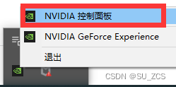

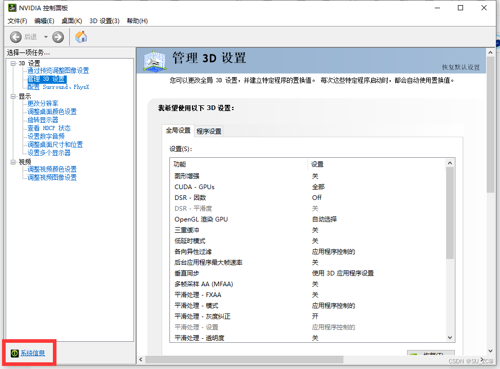

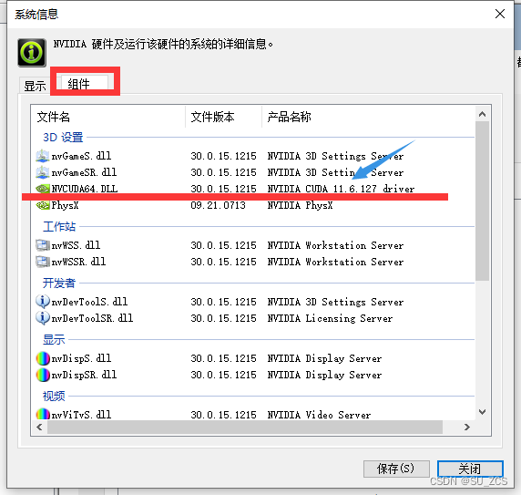

 我电脑上支持的cuda是11.6的

## 1.2 cuda [toolkit](https://so.csdn.net/so/search?q=toolkit&spm=1001.2101.3001.7020)下载

[​​​​​kCUDA Toolkit Archive | NVIDIA Developer](https://developer.nvidia.com/cuda-toolkit-archive "​​​​​kCUDA Toolkit Archive | NVIDIA Developer")

进入上述网页，找到适合的cuda

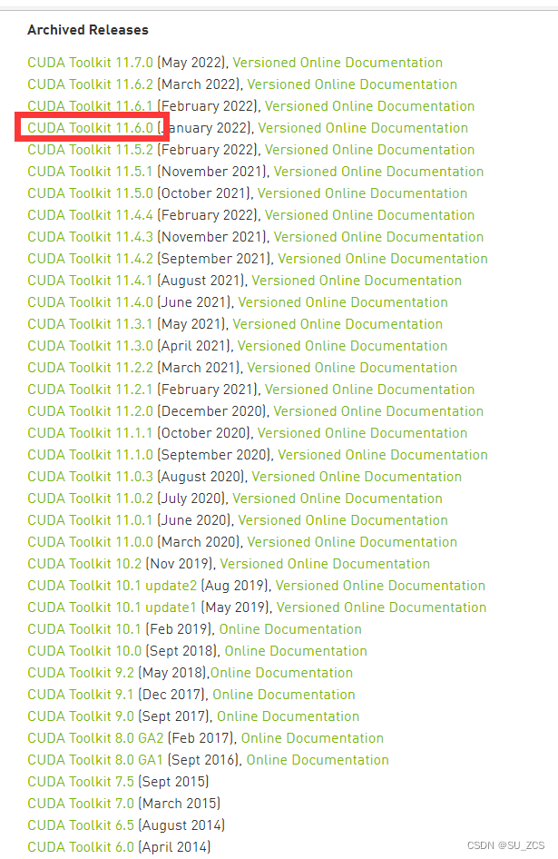

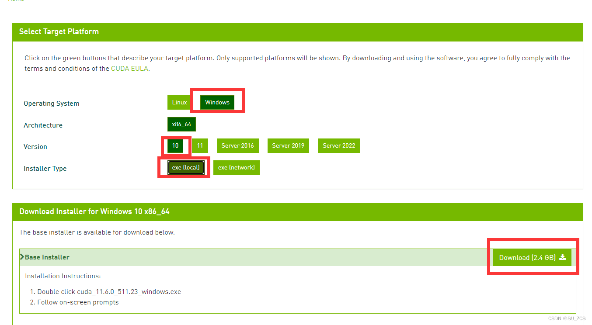

## 1.3 cuda toolkit安装

双击exe文件进行安装即可

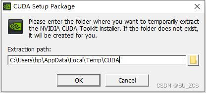

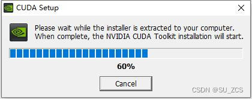

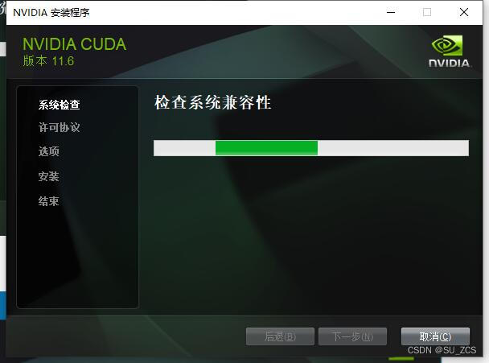

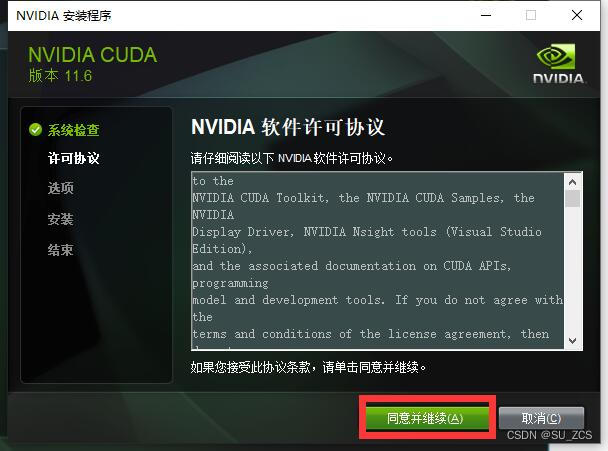

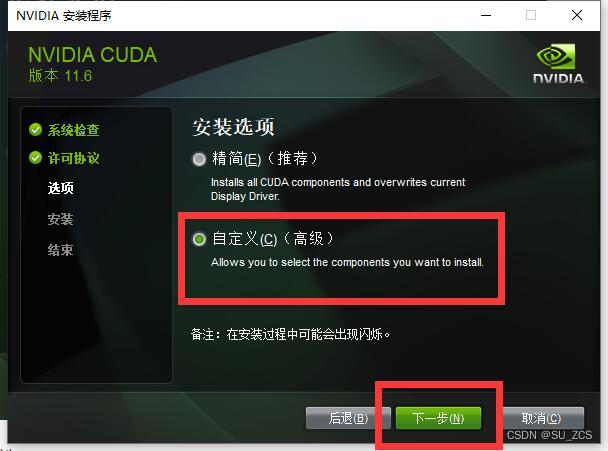

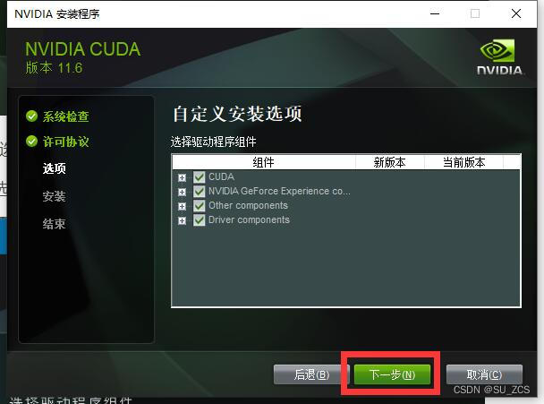

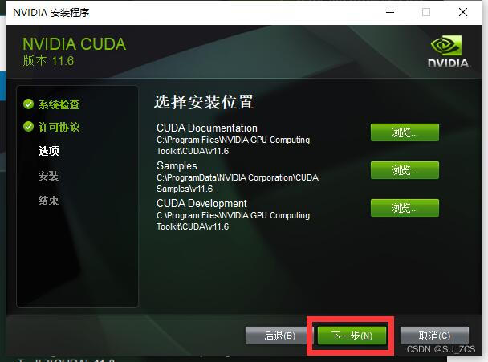

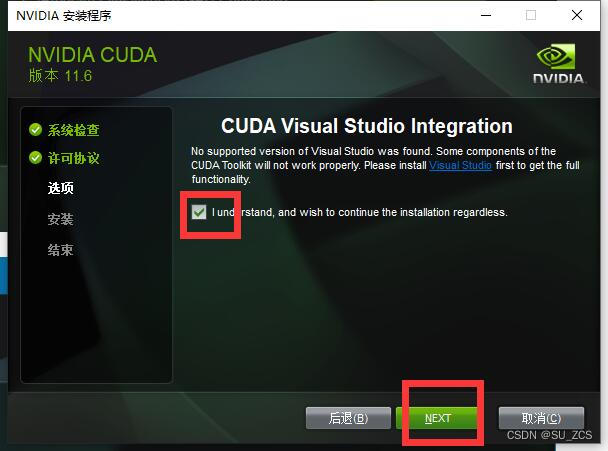

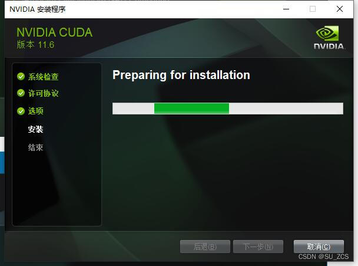

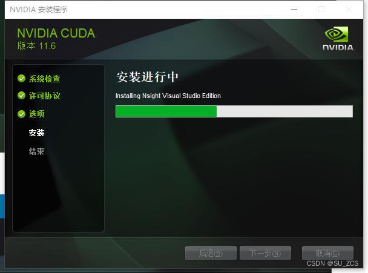

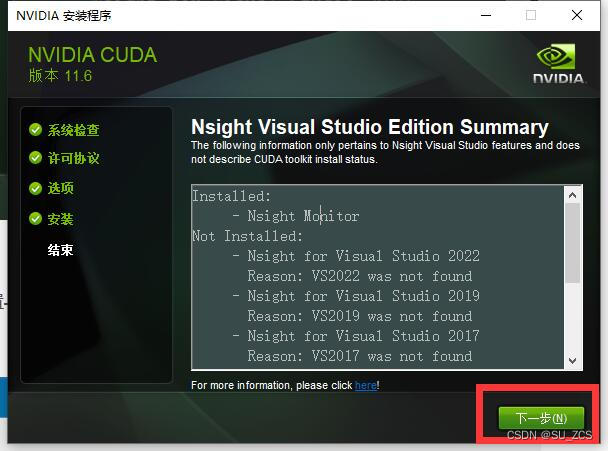

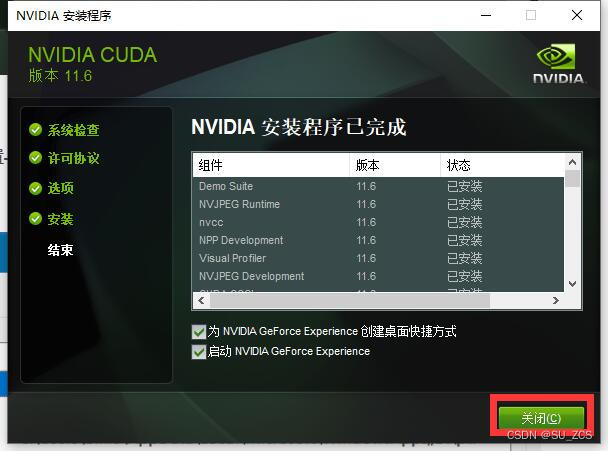

## 1.4 配置环境

 打开 设置->高级系统设置->环境变量 

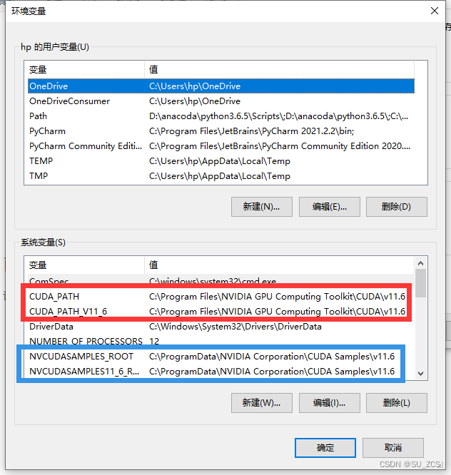

        红框里的是系统自动添加的，蓝框里的有些情况系统不会自动添加，需要手动添加，添加时注意自己的路径。

```cobol
NVCUDASAMPLES_ROOT  C:\ProgramData\NVIDIA Corporation\CUDA Samples\v11.6 NVCUDASAMPLES11_6_ROOT  C:\ProgramData\NVIDIA Corporation\CUDA Samples\v11.6
```

##  1.4 验证

 win+R，输入cmd，输入[nvcc](https://so.csdn.net/so/search?q=nvcc&spm=1001.2101.3001.7020) --version查看版本号，输入set cuda查看设置的环境变量

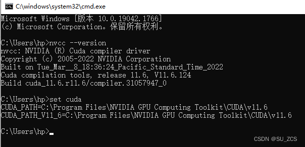

# 2 cuANN下载及安装 

## 2.1 cuDNN下载

 下载地址如下，下载之前需要注册一下  
[https://developer.nvidia.com/rdp/cudnn-download](https://developer.nvidia.com/rdp/cudnn-download "https://developer.nvidia.com/rdp/cudnn-download")


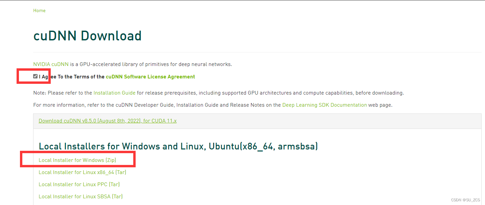

 如下链接，有适合自己的版本

[cuDNN Archive | NVIDIA Developer](https://developer.nvidia.com/rdp/cudnn-archive "cuDNN Archive | NVIDIA Developer")

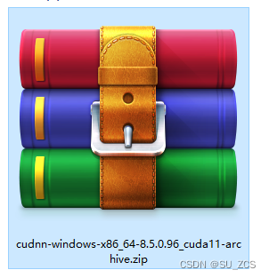

## 2.2 cuDNN配置

将cuDNN解压到D盘

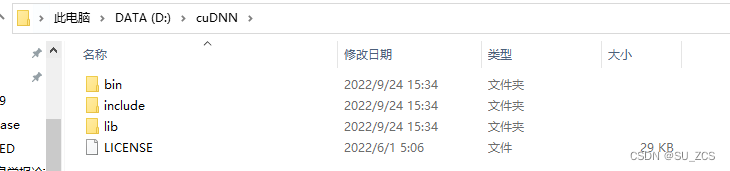

 将三个文件夹拷贝到到cuda的安装目录下。默认的安装路径为

```cobol
C:\Program Files\NVIDIA GPU Computing Toolkit\CUDA\v11.6
```

## 2.3 添加环境变量

```cobol
C:\Program Files\NVIDIA GPU Computing Toolkit\CUDA\v11.6\binC:\Program Files\NVIDIA GPU Computing Toolkit\CUDA\v11.6\includeC:\Program Files\NVIDIA GPU Computing Toolkit\CUDA\v11.6\libC:\Program Files\NVIDIA GPU Computing Toolkit\CUDA\v11.6\libnvvp
```

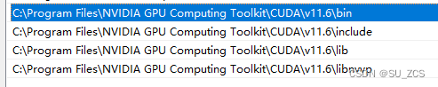

## 2.4 验证

       win+R cmd进入安装目录下，再进入到 extras\demo_suite下，执行.\bandwidthTest.exe和.\deviceQuery.exe，得到下图。

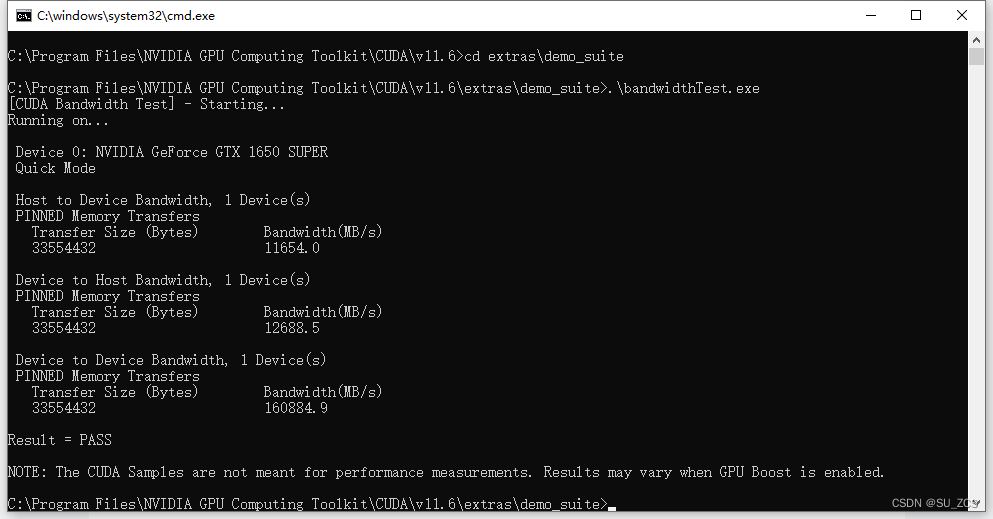

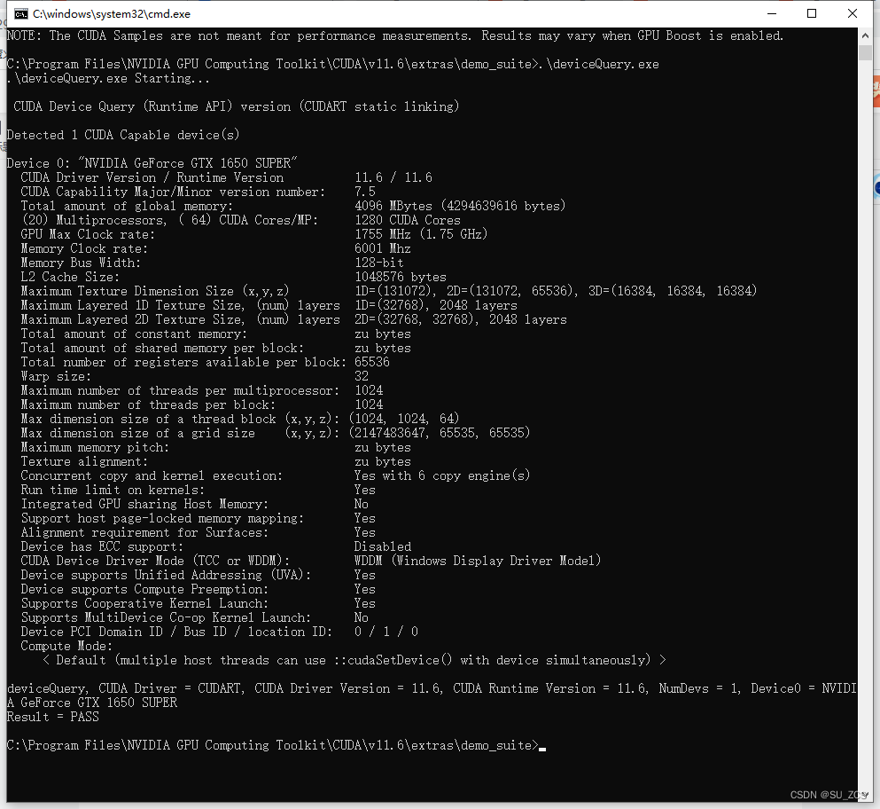

# 3 安装GPU版的torch（不需要torch的忽略）

当跑深度学习代码时，会出现如下错误，原因是原先安装的是GPU版本的torch。

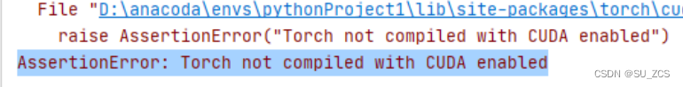

## 3.1 安装GPU版torch

进入官网[Start Locally | PyTorch](https://pytorch.org/get-started/locally/#no-cuda-1 "Start Locally | PyTorch")

选择各配置，复制红线链接

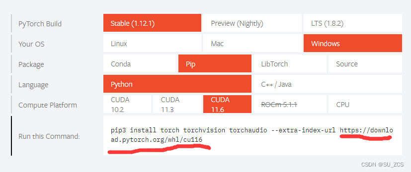

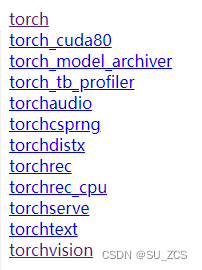

打开torch和torchvision选择适合自己的版本

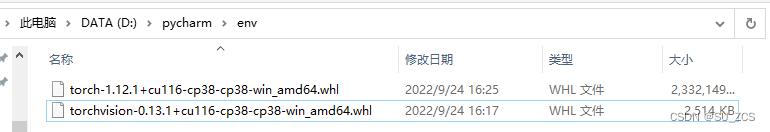

 进入该路径下执行pip

```cobol
pip install torch-1.12.1+cu116-cp38-cp38-win_amd64.whl pip install torchvision-0.13.1+cu116-cp38-cp38-win_amd64.whl
```

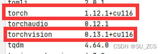

 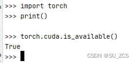

 cuda可以用，代码已经可以正常执行

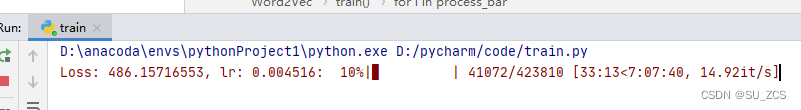
