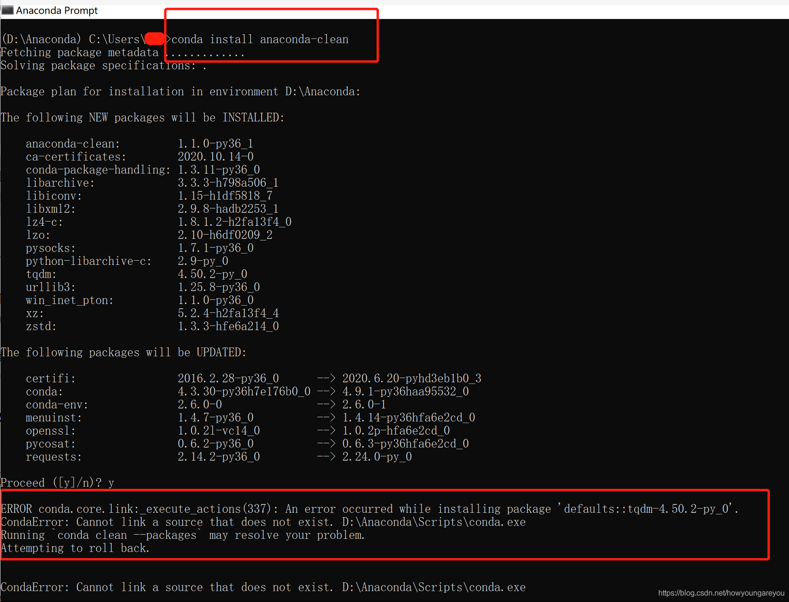

阅览了其他大神的卸载文章后，如

> https://blog.csdn.net/qq_40605139/article/details/95249601

这篇就给了我很多指导，但我在运行第一句的 `conda install anaconda-clean`

后就出错了，提示截图如下：  
然后就是各种百度，直到看到了下面这篇文章，才解决了问题：

> https://blog.csdn.net/weixin_40592798/article/details/105940860

所以我的整个卸载流程是这样的：

1. `conda install tqdm -f`
2. `conda install anaconda-clean`
3. `anaconda-clean --yes`
4. 找到并运行原安装目录下的 Uninstall-Anaconda3.exe
5. 最后就是把无效快捷模式这类的图标删了

彻底卸载完成后，重启电脑，然后成功安装上了[Anaconda](https://so.csdn.net/so/search?q=Anaconda&spm=1001.2101.3001.7020)最新版（**建议换一个新的安装目录，不要和以前的一样，免得挖坑**），推荐安装参考文章：

> https://blog.csdn.net/weixin_43715458/article/details/100096496

至此，咱又可以愉快的去学习Python了
