## **引言**

在Ubuntu系统中，无论是写文档还是在程序中写注释，都经常需要用到中文输入法。本文简单介绍了三种输入法框架，然后详细介绍了在Ubuntu 20.04系统中，IBus框架和Fcitx框架支持的中文输入法的配置和安装。

## **一、添加中文语言支持**

在安装中文输入法之前，首选要添加中文语言支持。

**1、单击Ubuntu桌面右上角的三角符号，然后选择“Settings”，打开系统设置页面。**

  

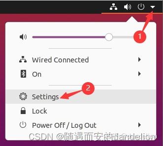

  

**2、在系统设置页面左侧的导航栏中选择“Region&Language”，然后在右侧页面中点击“Manage Install Languages”。**

  

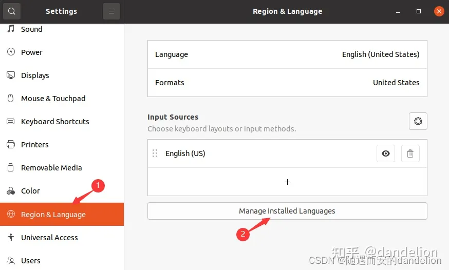

  

**3、如果弹出下面这个窗口，单击窗口中的 Install，然后等待安装完毕。**

  

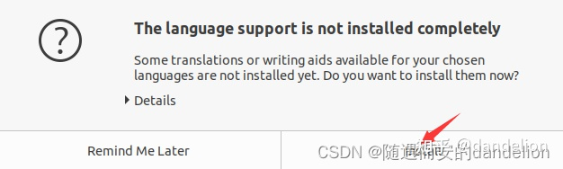

  

**4、单击“Install/Remove Languages”。**

  

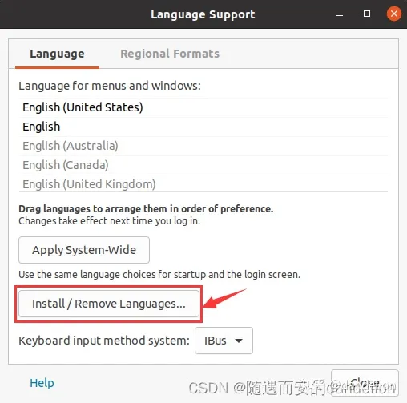

  

**5、勾选Chinese(simplified)，然后单击Apply，开始装简体中文。**

  

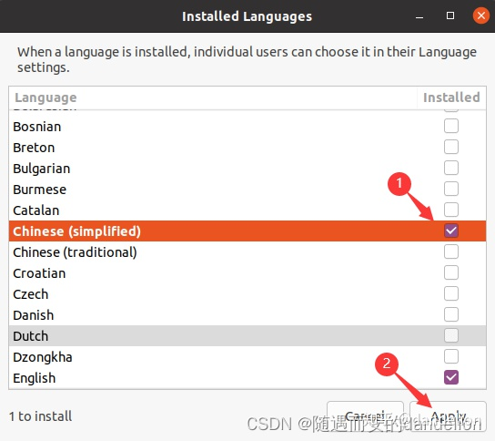

  

**6、耐心等待安装完毕。**

  

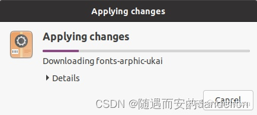

  

**7、安装完毕后，单击Close。**

  

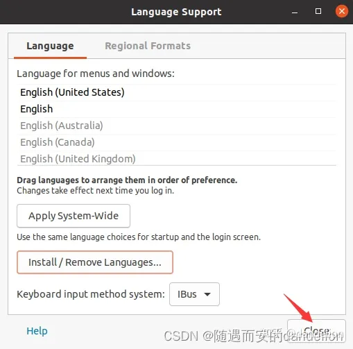

  

**8、重启系统。**

## **二、输入法框架**

在安装中文输入法之前，还要先安装或选择支持这种输入法的输入法框架。

在Linux系统上，常见的输入法框架（Keyboard input method system）有三种：**IBus**（Intelligent Input Bus）、**Fcitx**（FlexibleInput Method Framework）、**XIM**（X Input Method）。在Ubuntu20.04系统中，默认已经安装了IBus和XIM这两种输入法框架，Fcitx需要自己安装。

如下所示，每种输入法框架下，都有其支持的中文输入法（有些是框架自带的，有些需要另外安装）：

- **Fcitx**：谷歌拼音、搜狗拼音、搜狗五笔拼音
- **IBus**：智能拼音，五笔（86版）
- **XIM**：略(现在用的相对比较少)

**如何选择已安装的输入法框架？** 进入本文第一部分的第4步中的窗口，窗口中的最后一项就是输入法框架，选择后关闭窗口，重启系统。

## **三、添加IBus的中文输入法**

**1、重新进入本文第一部分第2步所示页面，单击+号。**

  

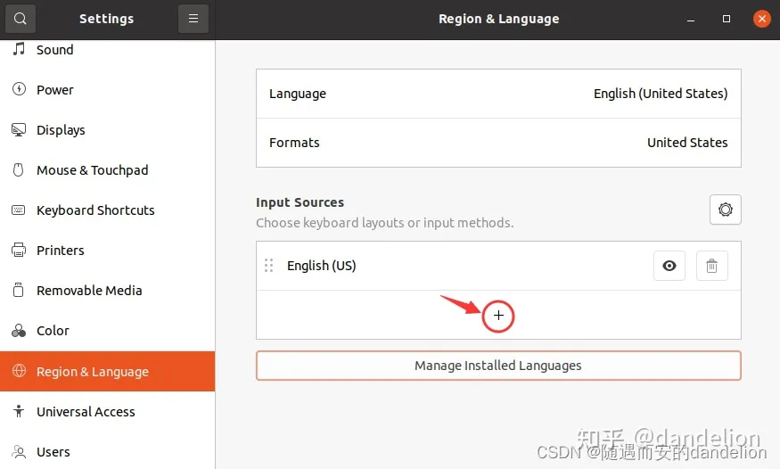

  

**2、双击Chinese。**

  

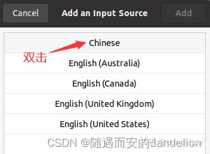

  

**3、可以看到有多种IBus中文输入法可选，选择中文输入法，比如：智能拼音Chinese(Intelligent Pinyin)，然后单击Add。可以反复添加多种中文输入法。**

  

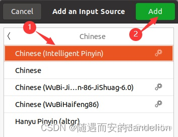

  

**4、如果需要，可以单击输入法右边的设置按钮，对输入法的特性进行设置。单击右上角的叉号关闭系统设置页面。至此，已完成智能拼音输入法的安装。**

  

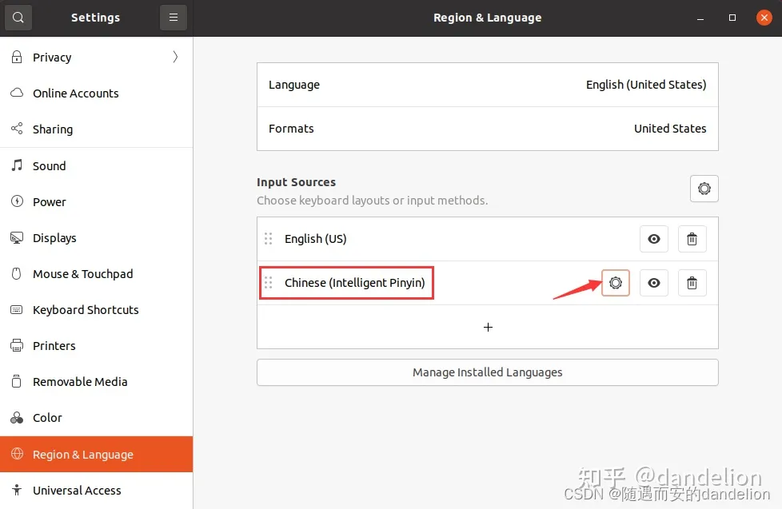

  

**5、在Ubuntu桌面的右上角可以看到并切换输入法，或者按“Win+空格”键切换。**

  

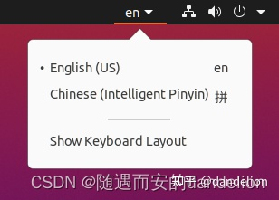

  

## **四、安装Fcitx的中文输入法**

**1、首先在终端中执行`fcitx --version` ，检测是否已经安装fcitx框架。**

  

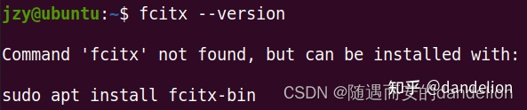

  

**2、安装fcitx框架**

```text
sudo apt-get update
sudo apt-get install fcitx-bin
```

如果安装不成功，可以先把Ubuntu使用的软件源换成国内的，比如：阿里源、清华源等。

  

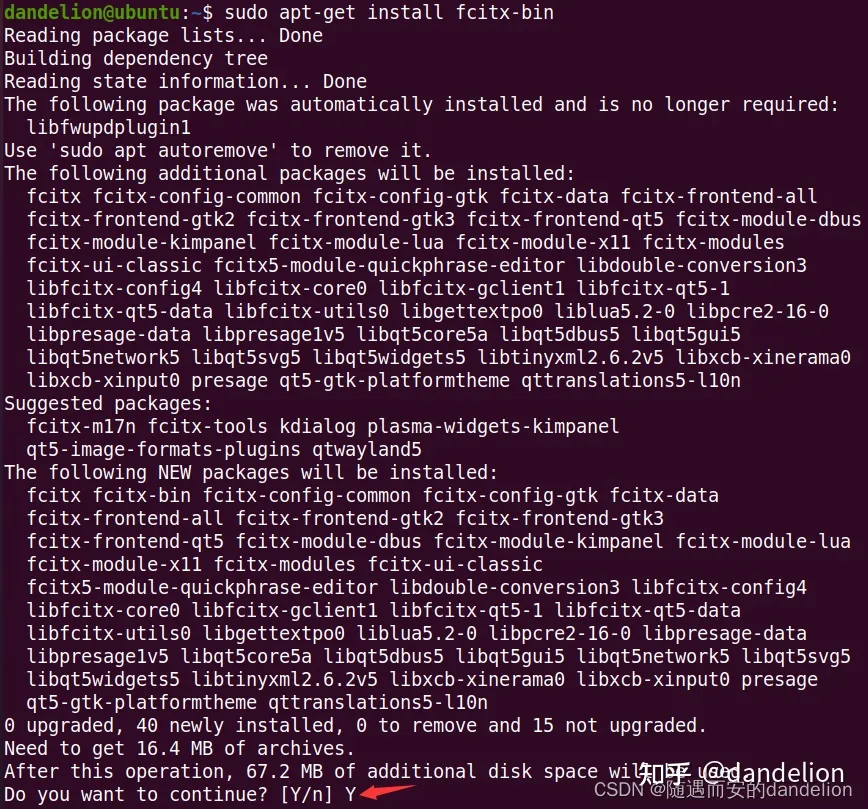

  

安装完成后，可以在Ubuntu桌面的右上角看到一个键盘图标，如下图所示：

  

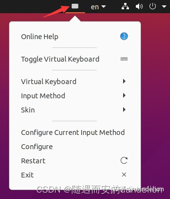

  

```text
sudo apt-get install fcitx-table 
sudo apt-get install fcitx-table-all
```

安装`fcitx-table`时，会自动安装拼音输入法`fcitx-pinyin`，如下图所示：

  

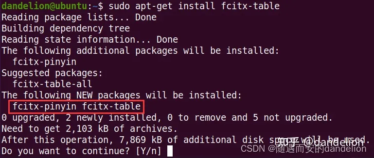

  

安装`fcitx-table-all`时，除了会自动安装`fcitx-table`和`fcitx-pinyin`之外，还会安装其他的一些输入法，比如：五笔、五笔拼音等等。本文没有安装`fcitx-table-all`。

  

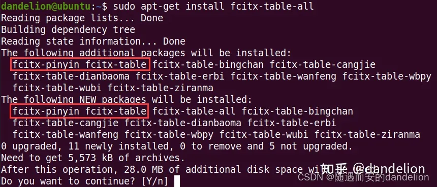

  

安装完成后，你会发现在本文第一部分的第4步所示的窗口中出现了输入法框架fcitx：

  

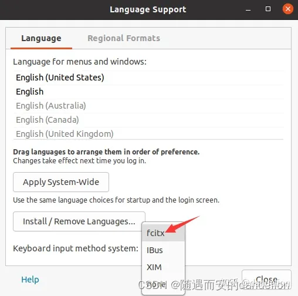

  

选择输入法框架fcitx，然后单击Close，重启系统。单击Ubuntu右上角的小键盘图标，在下拉菜单里选择Configure Current Input Method，可以看到已经安装的两个拼音输入法：

  

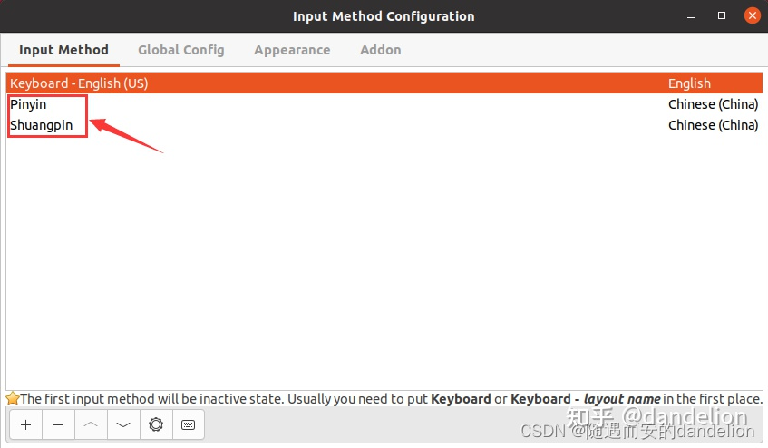

  

打开一个终端或者文本编辑器，按“CTRL+空格”键，在中文/英文输入法之间切换；按“CTRL+SHIFT”键，在fcitx框架中的多种中文输入法之间切换。

**3、安装fcitx框架支持的其他中文输入法，比如：谷歌拼音输入法。**

```text
sudo apt-get install fcitx-googlepinyin
```

  

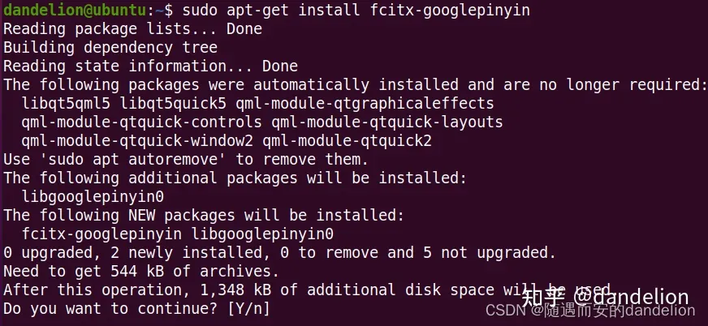

  

安装完成后，单击Ubuntu右上角的小键盘图标，在下拉菜单里选择Configure Current Input Method，可以看到已经安装的谷歌拼音拼音输入法：

  

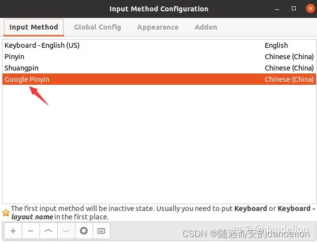

  

  

本文在CSDN、公众号、头条号和知乎同步发布，感谢关注。
