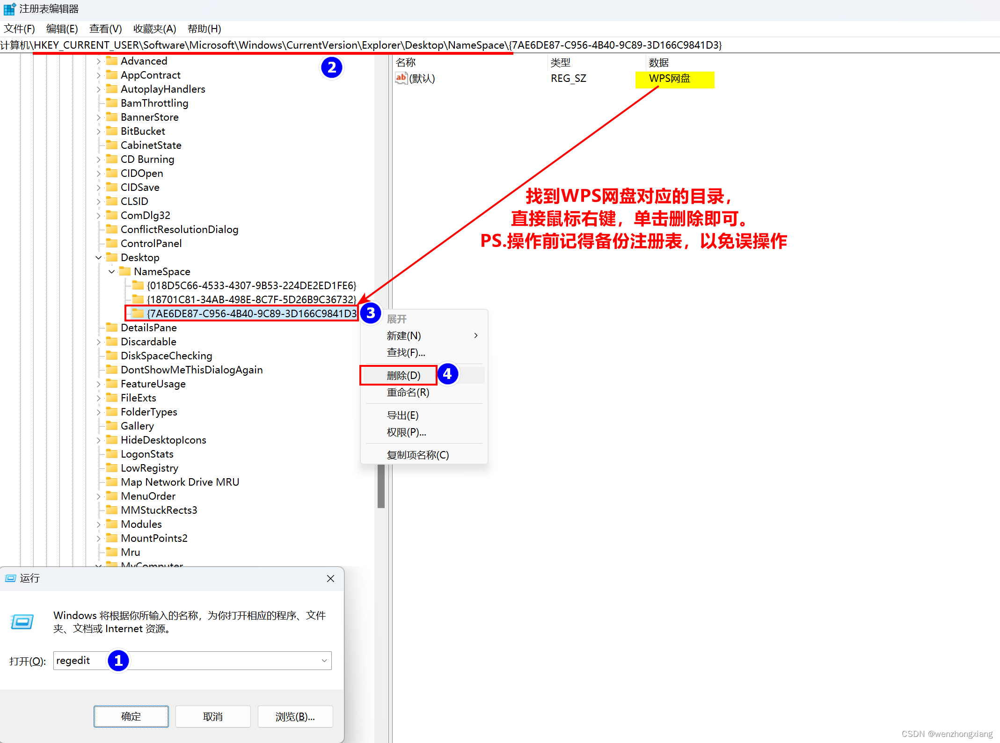

### 绿色软件开机自启

首先创建绿色软件快捷方式，然后复制下面路径，将快捷图标剪切到该目录中

C:\ProgramData\Microsoft\Windows\Start Menu\Programs\StartUp

即可在Task Manager-Startup apps查看。

## Antimalware service executable

方法一：

修改本地组策略

Gpedit.msc

计算机配置-管理模板-windows组件-Microsoft Defender Antivirus-Scan

Specify the maximum percentage of CPU utilization during a scan

打开-设置为启用-设置最大cpu占比为5。

方法二：

安装火绒

## DISM

## 耳机音量默认最大

快捷键 win + r 打开 regedit 注册表，定位到：（可以直接复制到地址栏，回车即可） “ 计算机\HKEY_LOCAL_MACHINE\SYSTEM\ControlSet001\Control\Bluetooth\Audio\AVRCP\CT ” 然后把 “DisableAbsoluteVolume” 的值改为 2 ，如果没有找到，那就自己新建 DWORD32 位，值设为 2，即可解决

## 安全模式

卸载文件

msconfig

引导-安全引导-最小minimal-确定-重新启动-删除软件

重复上述操作-取消勾选-自动重启

注意：如果有Bitlocker，先手动备份，防止硬盘锁死

## Windows资源管理器侧边栏

1、Win+R 打开运行栏/也可以直接Win键打开Windows开始菜单栏，输入 regedit 并按回车键，打开注册表编辑器。

2、在注册表编辑器中，按照以下路径展开注册表：

HKEY_CURRENT_USER\Software\Microsoft\Windows\CurrentVersion\Explorer\Desktop\NameSpace 3、在“NameSpace”下，依次展开文件夹子目录，找到需要删除的快捷方式目录，直接右键点击对应的文件夹目录，并选择“删除”即可。删除后，刷新“此电脑”页面或重新打开该页面，快捷方式图标已删除成功。 

常用软件对应路径，可以pin to quick access

WPS  
C:\Users\yours\Documents\WPSDrive\1081898886  
phone link  
C:\Users\yours\CrossDevice

windows自动更新